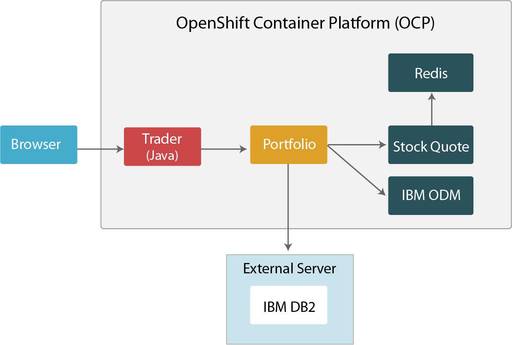
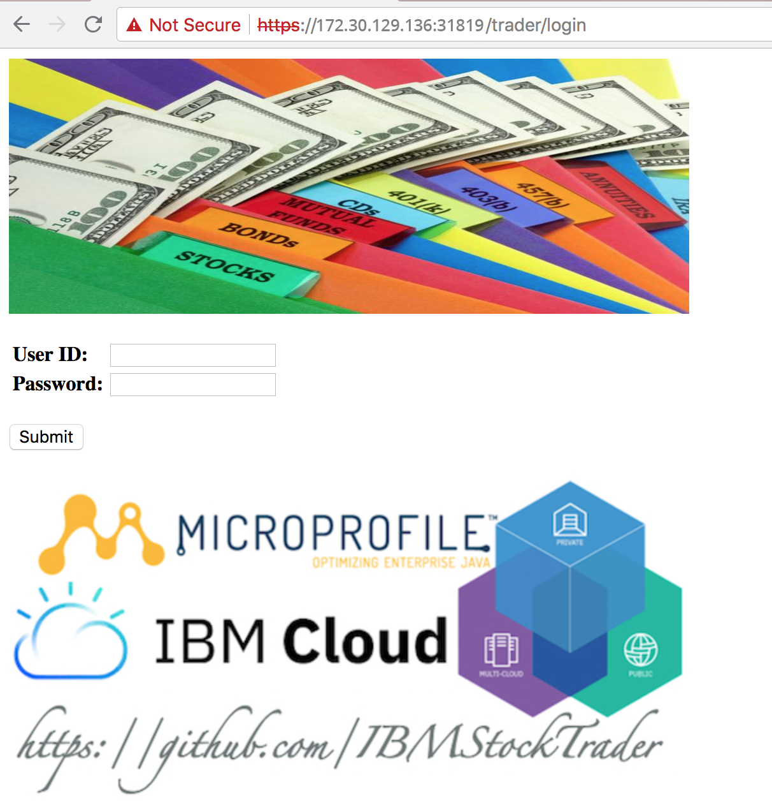
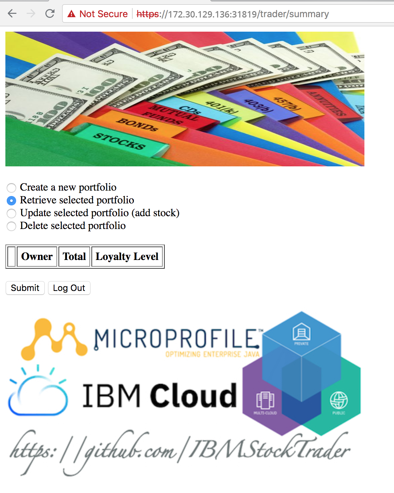
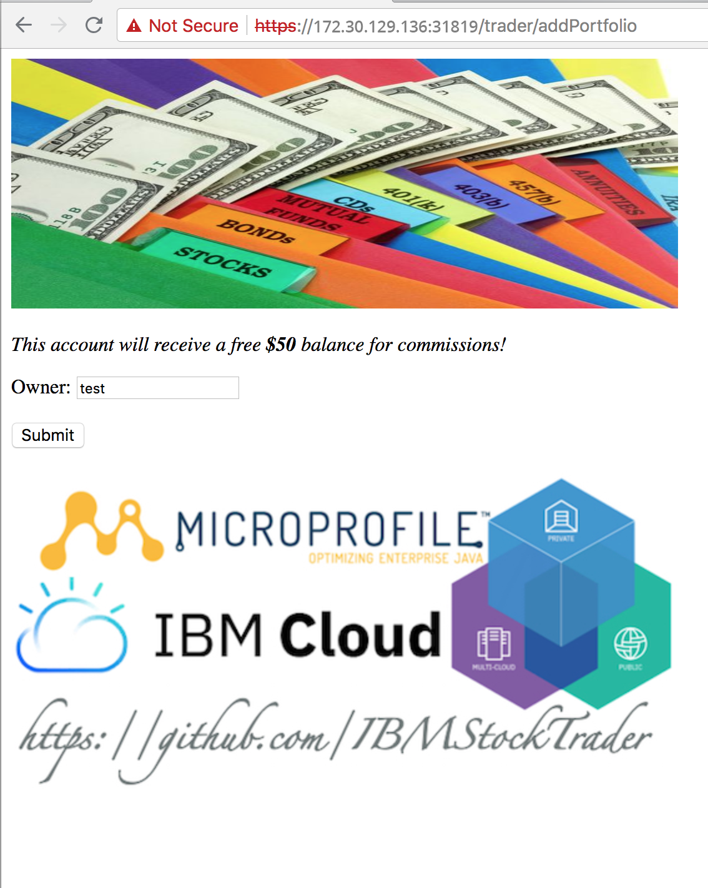
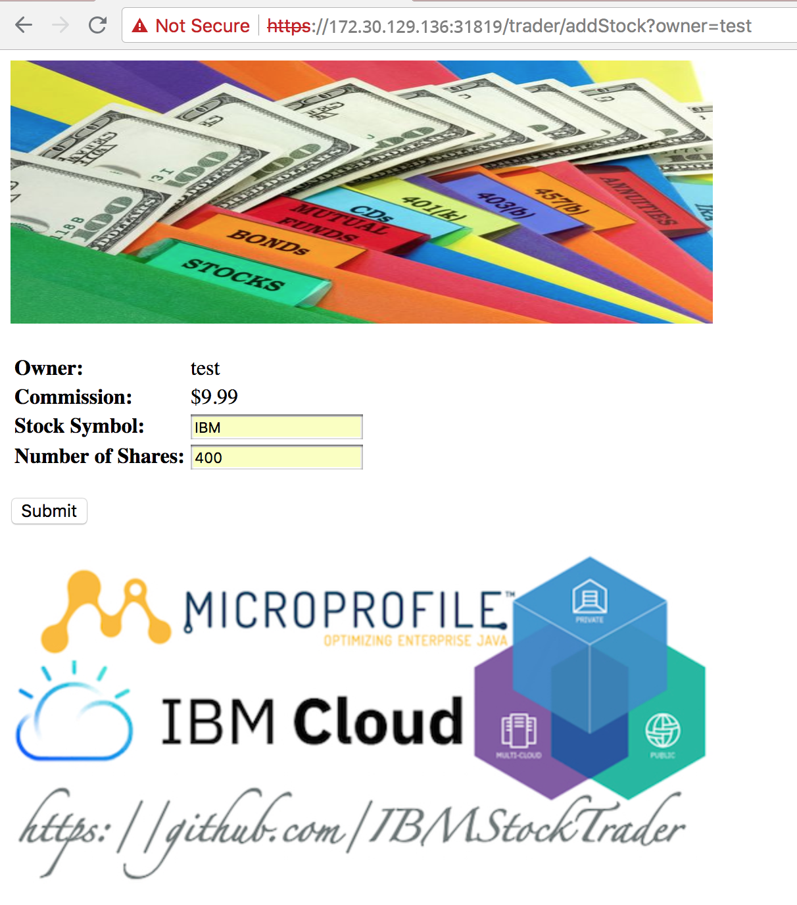
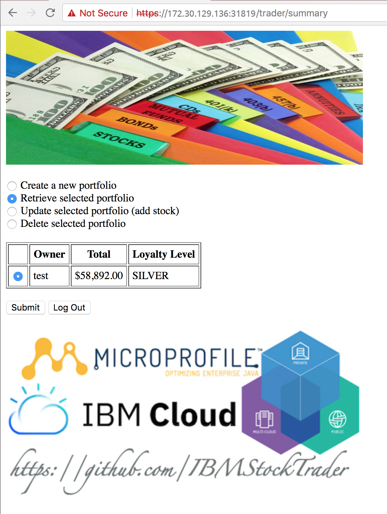

# IBM StockTrader Application

1.  [Introduction](#introduction)
2.  [Prerequisites](#Prerequisites)
3.  [Installation](#installation)
    - [Get The Code](#get-the-code)
    - [Platform](#platform)
    - [Middleware](#middleware) 
      - [Helm](#helm)
      - [IBM DB2](#ibm-db2)
      - [IBM ODM](#ibm-odm)
      - [Redis](#redis)
    - [Application](#application)
4.  [Verification](#verification)
5.  [Uninstallation](#uninstallation)
6.  [Files](#files)


## Introduction

The IBM Stock Trader application is a simple stock trading sample where you can create various stock portfolios and add shares of stock to each for a commission. It keeps track of each porfolio's total value and its loyalty level which affects the commission charged per transaction. It sends notifications of changes in loyalty level. It also lets you submit feedback on the application which can result in earning free (zero commission) trades, based on the tone of the feedback.

The overall architecture looks like the following diagram:

<p align="center">

</p>

Where you can find StockTrader specific microservices in blue and IBM middleware in purple all running on OpenStack Container Platform (OCP).

## Prerequisites

* OpenShift Container Platform 3.11 and 4.1

The following installation instructions guide you through installing the dependent software (DB2, Redis, etc) and configuring it for use by the stocktrader application. 

### Helm
 
If don't have helm install, here are the steps to configure the v2.14.1 helm version with Openshift Container Platform:

```
$ export TILLER_NAMESPACE=stocktrader
$ oc new-project $TILLER_NAMESPACE
$ oc project $TILLER_NAMESPACE
$ curl -s https://storage.googleapis.com/kubernetes-helm/helm-v2.14.1-linux-amd64.tar.gz | tar xz
$ cd linux-amd64
$ ./helm init --client-only
$ oc process -f https://github.com/openshift/origin/raw/master/examples/helm/tiller-template.yaml -p TILLER_NAMESPACE="${TILLER_NAMESPACE}" -p HELM_VERSION=v2.14.1 | oc create -f -
$ oc rollout status deployment tiller
$ ./helm version
$ oc policy add-role-to-user edit "system:serviceaccount:${TILLER_NAMESPACE}:tiller"
$ oc adm policy add-scc-to-user privileged -n stocktrader -z default
```

Here are the steps to install Helm 3 on OpenShift.
```
# curl -L https://mirror.openshift.com/pub/openshift-v4/clients/helm/latest/helm-linux-amd64 -o /usr/local/bin/helm
# chmod +x /usr/local/bin/helm
$ helm version
```

Refer this link [Steps to set up the Helm CLI to work with Openshift Container Platform.](https://blog.openshift.com/getting-started-helm-openshift/)

```
$ helm repo add stable https://kubernetes-charts.storage.googleapis.com
```

## Installation
### Get The Code

Before anything else, we need to **clone this Github repository** onto our workstations in order to be able to use the scripts, files and tools mentioned throughout this readme. To do so, clone this GitHub repository to a convenient location for you:

```
$ git clone https://github.com/vmware-ibm-jil/stocktrader-jil.git
Cloning into 'stocktrader-jil'...
remote: Enumerating objects: 25, done.
remote: Counting objects: 100% (25/25), done.
remote: Compressing objects: 100% (14/14), done.
remote: Total 142 (delta 3), reused 17 (delta 3), pack-reused 117
Receiving objects: 100% (142/142), 116.13 KiB | 0 bytes/s, done.
Resolving deltas: 100% (23/23), done.
Checking connectivity... done.

$ git fetch && git checkout v2.0
```

### Platform

1. Create a namespace called **stocktrader**. If you don't know how to do so, follow this [link](https://www.ibm.com/support/knowledgecenter/en/SSBS6K_2.1.0.3/user_management/create_project.html).

2. Change your kubernetes CLI context to work against your **stocktrader** namespace:

```
$ kubectl config set-context cluster.local-context --user=admin --namespace=stocktrader
Context "cluster.local-context" modified.
```
_Use the appropriate user in the above command_

3. Give privileged permissions to your recently created namespace as some the IBM middleware need them to function:

```
$ kubectl create rolebinding -n stocktrader st-rolebinding --clusterrole=privileged  --serviceaccount=stocktrader:default
rolebinding "st-rolebinding" created
$ kubectl get rolebindings                 
NAME             KIND                                       SUBJECTS
st-rolebinding   RoleBinding.v1.rbac.authorization.k8s.io   1 item(s)
```

### Middleware
IBM middleware will be installed using Helm charts as much as possible. Therefore, we need to install the helm first:

#### IBM DB2

Create a secret that holds your Docker Hub credentials.

```
$ kubectl create secret docker-registry st-docker-registry --docker-username=<userid> --docker-password=<password> --docker-email=<email> --namespace=stocktrader
secret "st-docker-registry" created
```

Here we are going to use the external db2 server.
1. Provision one ubuntu-16.04 VM.
2. Setup docker on this VM. [Steps to setup docker on ubuntu 16.04](https://www.digitalocean.com/community/tutorials/how-to-install-and-use-docker-on-ubuntu-16-04)
3. Run the following command to setup the containerised DB2:

```
$ sudo docker pull stocktraders/st-db2
$ sudo docker run -itd --name mydb2 --privileged=true -p 50000:50000 -e LICENSE=accept -e DB2INST1_PASSWORD=db2inst1 -e DBNAME=STOCKTRD -v /data:/database stocktraders/st-db2
$ sudo docker exec -ti mydb2 bash -c "su - db2inst1"
```
4. Update this [default_stocktrader_values.yaml](installation/default_stocktrader_values.yaml) file, replace the value of host to DB2 Server IP in db2 section.

We are set to use external db2 server.

#### Redis

1. Install Redis using the [default_redis_values.yaml](installation/default_redis_values.yaml) file:

```
$ helm install -name st-redis --namespace stocktrader stable/redis -f installation/default_redis_values.yaml
```

**IMPORTANT:** The Redis instance installed is a non-persistent non-HA Redis deployment

#### IBM ODM

1. Install IBM Operational Decision Manager (ODM) using the [default_odm_values.yaml](installation/default_odm_values.yaml) file:

```
$ helm install -name st-odm --namespace stocktrader ibm-charts/ibm-odm-dev -f installation/default_odm_values.yaml
```

**Note:** For more details to configure the IBM ODM refer this [link](https://github.com/ibm-cloud-architecture/stocktrader-app/tree/v2#ibm-odm)


### Application

The IBM StockTrader Application can be deployed to OpenShift Container Platform (OCP) using Helm charts. All the microservices that make up the application have been packaged into a Helm chart. They could be deployed individually using their Helm chart or they all can be deployed at once using the main umbrella IBM StockTrader Application Helm chart.

As we have done for the middleware pieces installed on the previous section, the IBM StockTrader Application installation will be done by passing the desired values/configuration for some its components through a values file called [default_stocktrader_values.yaml](installation/default_stocktrader_values.yaml). This way, the IBM StockTrader Application Helm chart is the template/structure/recipe of what components and Kubernetes resources the IBM StockTrader Application is made up of while the [default_stocktrader_values.yaml](installation/default_stocktrader_values.yaml) file specifies the configuration these need to take based on your credentials, environments, needs, etc.

**IMPORTANT:** The **values for the variables belonging to secrets** in the [default_stocktrader_values.yaml](installation/default_stocktrader_values.yaml) file **must be base64 encoded**. As a result, whatever the value you want to set the following **secret variables** with, they first need to be encoded using this command:

```
echo -n "<the_value_you_want_to_encode>" | base64
```

1. Deploy the IBM StockTrader Application using the [default_stocktrader_values.yaml](installation/default_stocktrader_values.yaml) file:

**TIP:** Remember you can use the **--set variable=value** to overwrite values within the [default_stocktrader_values.yaml](installation/default_stocktrader_values.yaml) file.

```
$ helm install -name trader --namespace stocktrader -f ./installation/default_stocktrader_values.yaml ./helm-chart/ --set trader.image.tag=basicregistry
```

## Verification

Here we are going to explain how to quickly verify our IBM StockTrader Application has been successfully deployed and it is working.

1. Check your Helm releases are installed:

```
$ helm list --namespace stocktrader
NAME      REVISION  UPDATED                   STATUS    CHART                           NAMESPACE  
st-odm    1         Tue Jan 22 14:10:33 2019  DEPLOYED  ibm-odm-dev-2.0.0               stocktrader
st-redis  1         Tue Jan 22 20:43:52 2019  DEPLOYED  redis-5.3.0                     stocktrader
test      1         Tue Jan 22 20:36:34 2019  DEPLOYED  stocktrader-app-0.2.0
```

export NODE_PORT=$(kubectl get --namespace stocktrader -o jsonpath="{.spec.ports[1].nodePort}" services trader-service)
export NODE_IP=$(kubectl get nodes --namespace stocktrader -o jsonpath="{.items[0].status.addresses[0].address}")

Get the application console link

```
echo https://$NODE_IP:$NODE_PORT/trader/login
```

2. Open the IBM StockTrader Application by pointing your browser to `https://172.30.129.136:31819/trader/login`

<p align="center">

</p>

**IMPORTANT:** Depending on what version of the **Trader** microservice (`basicregistry` or `latest`) you have deployed, the login screen will look differently. In the image above, we are showing the "simplest" path which is using the `basicregistry` version.

3. Log into the IBM StockTrader Application using User ID `stock` and Password `trader`:

<p align="center">

</p>

**IMPORTANT:** Again, based on the **Trader** BFF microservice version you deploy, you will use the aforementioned credentials or your IBMid credentials.

4. Click on Create a new portfolio and submit in order to create a test portfolio. Introduce the name for the portfolio you like the most and click on submit:

<p align="center">

</p>

5. With your newly created portfolio selected, click on Update selected portfolio (add stock) and submit. Then, introduce `IBM` and `400` for the Stock Symbol and Number of Shares fields respectively and click submit:

<p align="center">

</p>

6. Your IBM StockTrader application should now have a portfolio with 400 IBM shares:

<p align="center">

</p>
## Uninstallation

Since we have used `Helm` to install both the IBM StockTrader Application and the IBM (and third party) middleware the application needs, we then only need to issue the `helm delete <release_name> --purge --tls ` command to get all the pieces installed by a Helm release `<release_name>` uninstalled:

As an example, in order to delete all the IBM StockTrader Application pieces installed by its Helm chart when we installed them as the `test` Helm release:

Following command is for Helm 2.
```
$ helm delete test --purge
release "test" deleted
```

Following command is for Helm 3.
```
$ helm uninstall test
release "test" uninstalled
```

## Files

This section will describe each of the files presented in this repository.

#### installation - application

- [default_stocktrader_values.yaml](installation/default_stocktrader_values.yaml): Default IBM StockTrader version 2 Helm chart values file.

#### installation - middleware

- [default_redis_values.yaml](installation/default_redis_values.yaml): tailored Redis Helm chart values file with the default values that the IBM StockTrader Helm chart expects.
- [default_odm_values.yaml](installation/default_odm_values.yaml): tailored IBM Operation Decision Manager (ODM) Helm chart values file with the default values that the IBM StockTrader Helm chart expects.
